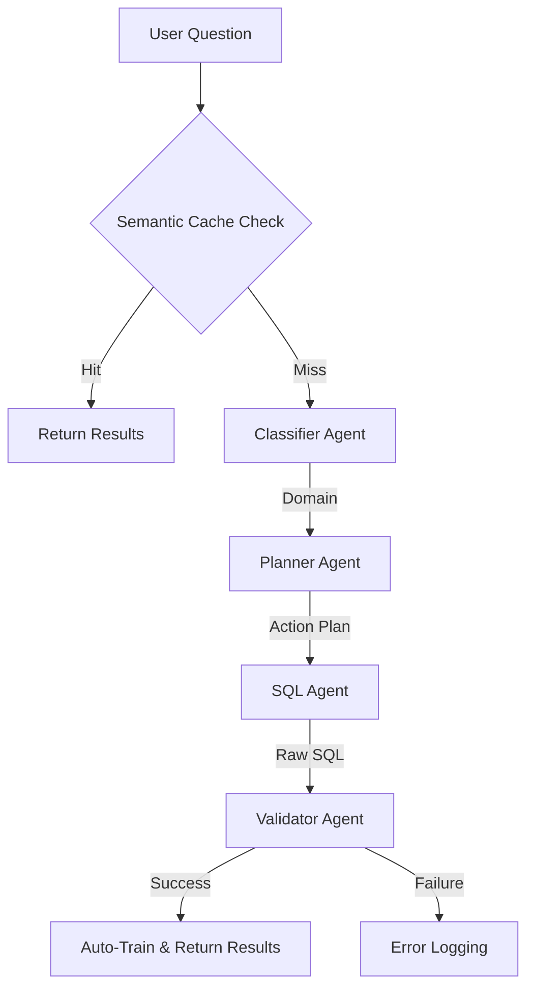

# FineTune-BI-LLM: Text-to-SQL with Local LLM & RAG

A production-ready Business Intelligence toolkit that turns natural language into SQL using **Vanna.ai**, **Ollama (DeepSeek-Coder)**, and **ChromaDB**.

## 🎯 Key Features

- **Multi-Agent Classifier → Planner → SQL → Validator pipeline**: Now includes a Classifier to narrow down schema focus and reduce latency.
- **Fast Path Semantic Caching**: Using ChromaDB to store and retrieve queries semantically. Even if you change "List" to "Show", the system recognizes the intent and returns a 0.5s response.
- **Schema-aware planning**: Prevents hallucinated columns by introspecting `information_schema`.
- **Self-learning loop**: Automatically stores successful question/SQL pairs back into ChromaDB.
- **Connection pooling**: via SQLAlchemy `QueuePool` to reuse PostgreSQL connections.
- **Local-first stack**: (no external APIs): Ollama LLM + ChromaDB vector store + Postgres.
- **Workflow logging**: Each agent phase now emits a concise `[Workflow]` line so you can trace which agent ran without dumping raw prompts.
- **Prompt noise control**: Ollama prompt dumps are suppressed by default and can be re-enabled via `VANNA_SHOW_PROMPTS=1` when debugging.

## 🧠 Architecture Overview



- **Classifier Agent**: Categorizes queries into domains (FLIGHT, BOOKING, PASSENGER, etc.) to filter relevant schema metadata.
- **Planner Agent**: Retrieves schema + similar examples, outputs plan.
- **SQL Agent**: Turns plan into schema-qualified SQL (`postgres_air."table"`).
- **Validator Agent**: Blocks unsafe keywords, runs SQL, and auto-trains on success.

## 📁 Project Layout

| File/folder | Responsibility |
|-------------|----------------|
| `app.py` | Entry point with interactive CLI + `ask_question` helper |
| `agent_pipeline.py` | Core 4-agent pipeline (Classifier, Planner, SQL, Validator) |
| `connections.py` | Vanna/DB setup, connection pooling, and **Semantic Normalization Caching** |
| `train.py` | Schema ingestion + vector-store training |
| `synthetic_training_generator.py` | Generates 20–50 synthetic NL/SQL pairs for ChromaDB |
| `requirements.txt` | Python dependencies |
| `.env` | Configuration (DB credentials, LLM model, vector store path) |
| `vanna_storage/` | Local ChromaDB embeddings |
| `generated_training_data.json` | Audit log of synthetic generations |

## 🚀 Getting Started

### 1. Prerequisites
```bash
ollama serve &
ollama pull deepseek-coder:6.7b
```
Ensure PostgreSQL (Postgres Air sample DB) is running locally.

### 2. Install dependencies
```bash
pip install -r requirements.txt
```

### 3. Configure `.env`
```env
DB_TYPE=postgres
DB_HOST=localhost
DB_PORT=5432
DB_USER=postgres
DB_PASS=supersecure
DB_NAME=postgres_air
DB_SCHEMA=public
LLM_MODEL=deepseek-coder:6.7b
VEC_STORAGE_PATH=./vanna_storage
```

### 4. Train (first time)
```bash
python train.py
```
- Reads schemas + relationships.
- Samples data for context.
- Embeds everything into ChromaDB.

### 5. (Optional) Boost with synthetic data
```bash
python synthetic_training_generator.py
```
Generates additional validated NL/SQL pairs to improve the planner.

### 6. Run the app
```bash
python app.py
```
You will be prompted to enter natural language questions.

## 🗣️ Asking NLP Questions

Use `app.ask_question()` directly:
```python
from app import ask_question
result = ask_question("Show me the top 5 airports by name in the US")
print(result)
```

Or run `python app.py` for an interactive CLI:
```
💬 Ask your question: <type here>
```
Type `exit` or `quit` to stop.

- `-q / --question`: Run a single question without the interactive loop.
- `-t / --test`: Run the built-in test question list.
- `VANNA_SHOW_PROMPTS=1`: Run this when you *need* to see the Ollama prompts/response dumps for debugging (hidden otherwise).

## 🧪 Synthetic Training Generator

`synthetic_training_generator.py` is **optional but recommended**:

| Scenario | Use synthetic generator? | Why |
|----------|--------------------------|-----|
| First-time setup | ✅ Yes | Seeds ChromaDB with diverse examples quickly. |
| Adding new tables | ✅ Yes | LLM learns new schema faster. |
| Pattern failures (joins/filters) | ✅ Yes | Provide targeted examples. |
| Regular inference | ❌ No | Self-learning is sufficient after bootstrapping. |
| Production usage | ❌ No | Use only when you need new Q/SQL pairs. |

**Best practice**: run it once after `train.py` and only rerun when adding tables or addressing specific mistakes.

## 🛠️ Next Steps & Roadmap

**Short-term**
- [x] Planner/SQL/Validator pipeline running ✅
- [x] Schema-introspection + strict schema reference ✅
- [x] Self-learning loop implemented ✅
- [ ] Test 50+ NL queries to cover edge cases
- [ ] Track query latency + register metrics

**Mid-term**
- Add Flask/FastAPI + React UI for business users
- Cache repeated questions to reduce LLM calls
- Add MySQL/SQLite connectors inside `connections.py`

**Long-term**
- Fine-tune DeepSeek with domain-specific SQL patterns
- Build query analytics dashboard
- Support multi-database federation
- Collect and surface feedback for retraining

## ❓ FAQ

**How do I ask NL questions?**
Use the interactive CLI (`python app.py`) or call `ask_question()` directly with a string.

**Is `synthetic_training_generator.py` required?**
Not always. It’s great for the initial bootstrap or when the planner struggles with new tables/patterns. After a few successful queries, the self-learning loop keeps improving accuracy.

**What’s the next step?**
- Validate results on real BI questions.
- Prototype a web or API front end calling `ask_question()`.
- Monitor success rate and refine planner prompts.

## 🧵 Troubleshooting

1. `Column does not exist` → Run `train.py`, ensure `information_schema.columns` contains the table.
2. Empty ChromaDB → Re-run `python train.py` and optionally `synthetic_training_generator.py`.
3. Ollama errors → Start `ollama serve` and ensure the model is pulled.
4. Slow generation → Use a trimmed-down model or increase vector store resources.

## 🧾 Resources

- [Vanna docs](https://vanna.ai/docs)
- [Ollama models](https://ollama.ai/library)
- [ChromaDB docs](https://docs.trychromadb.com/)
- [PostgreSQL info schema](https://www.postgresql.org/docs/current/information_schema.html)

---

**Last updated**: March 6, 2026  
**Status**: Beta (production-ready)
