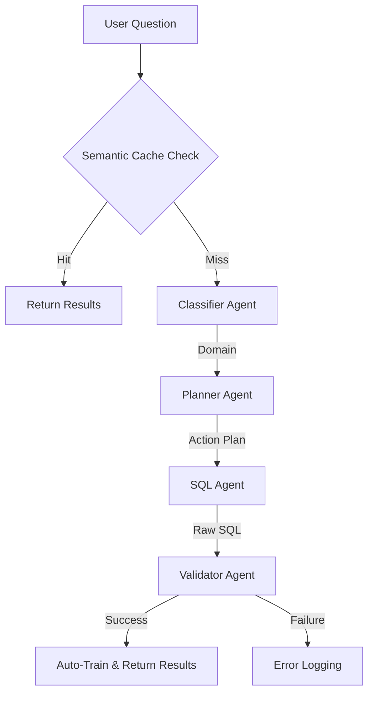

# FineTune-BI-LLM: Text-to-SQL with Local LLM & RAG

A production-ready Business Intelligence toolkit that turns natural language into SQL using **Vanna.ai**, **Ollama (DeepSeek-Coder)**, and **ChromaDB**.

## 🎯 Key Features

- **Tiered Multi-Model Orchestration (V2)**: Uses a fast 3B model (Architect) for planning and a powerful 6.7B model (SQL Engineer) for generation.
- **Smart Table Protection**: Dynamic pruning logic that cross-references queries against schema metrics (e.g., protects `flight` for "miles" or "velocity" queries even if "flight" isn't mentioned).
- **Off-Topic Guard**: Semantic filter that rejects greetings or random chat, providing a helpful summary of what the assistant *can* answer instead of failing.
- **SQL Pre-Validation (V3)**: Now includes **Hex Healing** to fix internal LLM junk (e.g., `flight67e..._id` -> `flight_id`) and repairs broken join syntax (`f. = bl.`).
- **Human-Readable Results**: Optimized SELECT logic that prioritizes descriptive columns (names, titles, models) over raw IDs.
- **PgAdmin-Ready Output**: Displays raw SQL in markdown blocks for easy copy-pasting and automatically exports current results to `latest_query.sql`.
- **Smart Context Relevancy**: Architect ignores irrelevant structural examples from ChromaDB to prevent "cross-pollination" errors.
- **Poisoned Cache Bypass**: Support for `run(question, use_cache=False)` to force re-generation when semantic cache contains bad data.
- **Automated Self-Correction**: Validator catches SQL errors and feeds them back to the SQL Agent for targeted retries.
- **Auto-LIMIT Guard**: Queries without a `LIMIT` clause automatically get `LIMIT 10` appended.
- **Fast Path Semantic Caching**: Recognizes semantically similar questions and returns cached results in <1s.
- **FK-Aware SQL Generation**: The SQL Agent receives the full foreign key relationship graph, enabling correct multi-hop joins.
- **Self-learning loop**: Successful question/SQL pairs are automatically stored back into ChromaDB.
- **Connection pooling**: via SQLAlchemy `QueuePool` to reuse PostgreSQL connections.
- **Local-first stack**: Ollama LLM + ChromaDB vector store + Postgres — no external APIs required.

## 🧠 Architecture Overview



- **Classifier Agent**: Categorizes queries into domains (FLIGHT, BOOKING, PASSENGER, etc.) to filter relevant schema metadata.
- **Planner Agent**: Retrieves cached schema + similar examples, outputs a structured plan with TABLES, JOIN_LOGIC, and STEPS.
- **SQL Agent**: Turns plan into schema-qualified SQL with the full FK graph, then passes through UUID stripping, multi-query guard, and auto-LIMIT.
- **SQL Pre-Validator**: Fuzzy-matches table/column names against actual schema using `difflib` before execution.
- **Validator Agent**: Blocks unsafe keywords, runs SQL, triggers self-correction on failure or self-learning on success.

## 📁 Project Layout

| File/folder | Responsibility |
|-------------|----------------|

| `app.py` | Entry point with interactive CLI + `ask_question` helper |
| `agent_pipeline.py` | Core 4-agent pipeline (Classifier, Planner, SQL, Validator) |
| `connections.py` | Vanna/DB setup, connection pooling, and **Semantic Normalization Caching** |
| `train.py` | Schema ingestion + vector-store training |
| `synthetic_training_generator.py` | Generates 100+ synthetic NL/SQL pairs using batch complex logic |
| `requirements.txt` | Python dependencies |
| `.env` | Configuration (DB credentials, LLM model, vector store path) |
| `vanna_storage/` | Local ChromaDB embeddings |
| `generated_training_data.json` | Audit log of synthetic generations |

## 🚀 Getting Started

### 1. Prerequisites

```bash
ollama serve &
ollama pull deepseek-coder:6.7b
```

Ensure PostgreSQL (Postgres Air sample DB) is running locally.

### 2. Install dependencies

```bash
pip install -r requirements.txt
```

### 3. Configure `.env`

```env
DB_TYPE=postgres
DB_HOST=localhost
DB_PORT=5432
DB_USER=postgres
DB_PASS=supersecure
DB_NAME=postgres_air
DB_SCHEMA=public
LLM_MODEL=deepseek-coder:6.7b
VEC_STORAGE_PATH=./vanna_storage
```

### 4. Train (first time)

```bash
python train.py
```

- Reads schemas + relationships.
- Samples data for context.
- Embeds everything into ChromaDB.

### 5. (Optional) Boost with synthetic data

```bash
python synthetic_training_generator.py
```

Generates additional validated NL/SQL pairs using **multi-threaded execution** (4x faster) to improve the planner's knowledge base.

### 6. Run the app

```bash
python app.py
```

You will be prompted to enter natural language questions.

## 🗣️ Asking NLP Questions

Use `app.ask_question()` directly:

```python
from app import ask_question
result = ask_question("Show me the top 5 airports by name in the US")
print(result)
```

Or run `python app.py` for an interactive CLI:

```💬 Ask your question: <type here>
```

Type `exit` or `quit` to stop.

- `-q / --question`: Run a single question without the interactive loop.
- `-t / --test`: Run the built-in test question list.
- `VANNA_SHOW_PROMPTS=1`: Run this when you *need* to see the Ollama prompts/response dumps for debugging (hidden otherwise).

### Advanced Features:
- **Batch-Based Generation**: Works in batches of 10 to prevent LLM output truncation.
- **Complexity Rotation**: Automatically alternates between **BASIC, JOINS, AGGREGATES, and ADVANCED** logic to ensure a balanced knowledge base.
- **Schema Auto-Fixer**: Injects schema prefixes into hallucinated SQL before retraining.
- **Preview Validation**: Only trains queries that pass live database execution.

**Best practice**: run it once after `train.py` and only rerun when adding tables or addressing specific mistakes.

## 🛠️ Next Steps & Roadmap

**Short-term**

- [x] Planner/SQL/Validator pipeline running ✅
- [x] Schema-introspection + strict schema reference ✅
- [x] Self-learning loop implemented ✅
- [x] Latency tracking + metrics logging ✅
- [x] SQL Pre-Validation Layer (fuzzy table/column matching) ✅
- [x] Startup caching for schema, relationships, samples ✅
- [x] Auto-LIMIT safety guard ✅
- [x] Smart Table Protection (Math/Travel logic) ✅
- [x] PgAdmin-Ready SQL Export ✅
- [x] Batch-Based Synthetic Generation ✅
- [ ] Test 50+ NL queries to cover edge cases

**Mid-term**

- Add Flask/FastAPI + React UI for business users
- Switch to a faster LLM (Gemini Flash API or GPU-accelerated Ollama)
- Add MySQL/SQLite connectors inside `connections.py`

**Long-term**

- Fine-tune DeepSeek with domain-specific SQL patterns
- Build query analytics dashboard (from `metrics.jsonl`)
- Support multi-database federation
- Collect and surface user feedback for retraining

## ⚡ Performance Tips (Mac 16GB RAM)

| Optimization | Expected Impact | How |
|---|---|---|
| **Use Apple Silicon GPU** | 3-5x faster inference | Ollama auto-detects Metal GPU on M-series Macs |
| **Smaller model** (`deepseek-coder:1.3b`) | 2-3x faster | Change `LLM_MODEL` in `.env` (lower accuracy) |
| **Quantized model** (`qwen2.5-coder:3b`) | 2x faster, better accuracy | `ollama pull qwen2.5-coder:3b` |
| **API-based LLM** (Gemini Flash) | 10-20x faster | Free tier available, swap Ollama for API client |
| **Reduce `num_ctx`** | Less RAM, faster | Set `OLLAMA_NUM_CTX=2048` (default: 4096) |

> **Note**: The 4 agents are sequential by design (each needs the previous output). Parallelism does not help here — faster inference is the key.

## ⚠️ Known Limitations & Cons

| Limitation | Impact | Mitigation |
|---|---|---|
| **6.7B model accuracy** | Hallucinated columns/joins on complex queries | SQL Pre-Validator catches ~80% of these |
| **Sequential pipeline** | Total latency = sum of all 4 LLM calls (50-120s on CPU) | Use GPU or API model |
| **No multi-turn context** | Each question is independent — no "follow up" support | Future: add conversation memory |
| **PostgreSQL only** | MySQL/SQLite connectors exist but are untested | Future: expand DB support |
| **No UI** | CLI-only interface | Future: Flask/React frontend |
| **Auto-LIMIT 100** | Large analytical queries may need manual LIMIT override | Pass explicit LIMIT in the question |
| **Self-learning pollution** | Bad queries could be auto-trained into ChromaDB | Future: add human-in-the-loop validation |

## ❓ FAQ

**How do I ask NL questions?**
Use the interactive CLI (`python app.py`) or call `ask_question()` directly with a string.

**Is `synthetic_training_generator.py` required?**
Not always. It’s great for the initial bootstrap or when the planner struggles with new tables/patterns. After a few successful queries, the self-learning loop keeps improving accuracy.

**What’s the next step?**

- Validate results on real BI questions.
- Prototype a web or API front end calling `ask_question()`.
- Monitor success rate and refine planner prompts.

## 🧵 Troubleshooting

1. `Column does not exist` → Run `train.py`, ensure `information_schema.columns` contains the table.
2. Empty ChromaDB → Re-run `python train.py` and optionally `synthetic_training_generator.py`.
3. Ollama errors → Start `ollama serve` and ensure the model is pulled.
4. Slow generation → Use a trimmed-down model or increase vector store resources.

## 🧾 Resources

- [Vanna docs](https://vanna.ai/docs)
- [Ollama models](https://ollama.ai/library)
- [ChromaDB docs](https://docs.trychromadb.com/)
- [PostgreSQL info schema](https://www.postgresql.org/docs/current/information_schema.html)

---

**Last updated**: March 10, 2026  
**Status**: Beta (active development)
